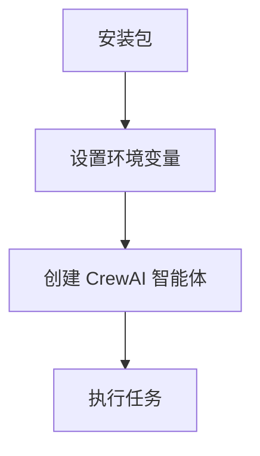
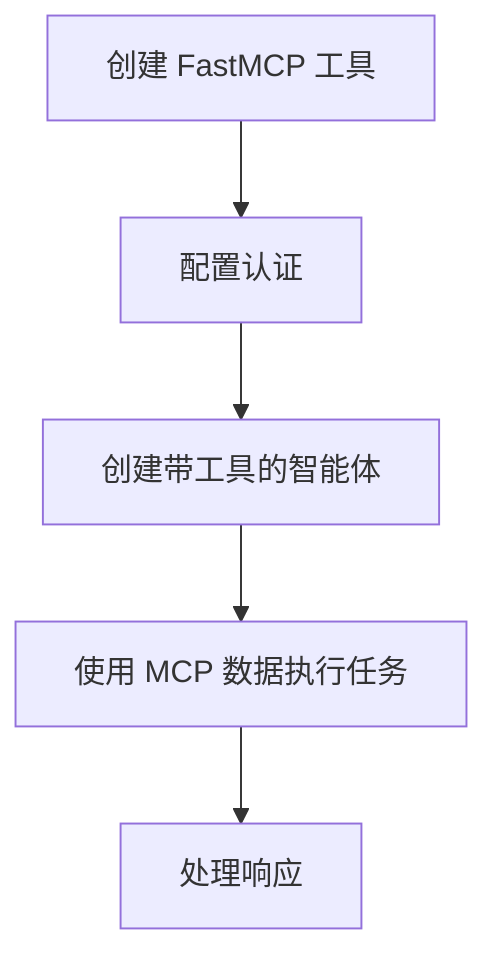
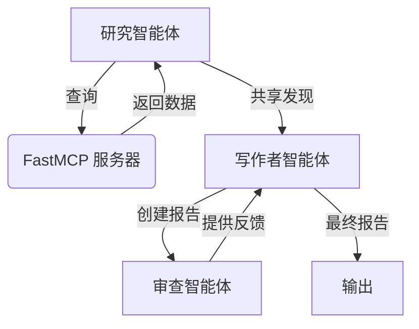

# CrewAI 与 FastMCP 服务器集成课程（CrewAI with FastMCP Server Integration Course）

本课程通过循序渐进的编程示例，教初学者如何使用 CrewAI 与 FastMCP 服务器集成。

## 课程概览（Course Overview）

本课程面向具备基础 Python 知识的初学者开发者，旨在学习如何将 CrewAI 智能体与 FastMCP 服务器集成。课程涵盖基础概念、实践实现以及构建智能工作流的高级模式。

## 课程章节（Lessons）

### 第 1 课：使用 MCP 服务器接入设置 CrewAI
- 安装所需包
- 设置环境变量
- 创建基础 CrewAI 智能体
- 执行简单任务



### 第 2 课：将 MCP 服务器与 CrewAI 集成
- 创建用于 MCP 服务器访问的自定义工具
- 配置认证和连接设置
- 在智能体任务中使用 MCP 服务器数据
- 处理错误和异常



### 第 3 课：使用 MCP 服务器的高级 CrewAI 模式
- 实现多智能体工作流
- 使用层级流程
- 通过 MCP 服务器在智能体间共享数据
- 存储和检索研究发现
- 实现质量保证流程



## 开始使用（Getting Started）

### 使用 pip（传统方法）

1. 安装要运行的课程所需的包：
```bash
pip install -r lesson_01/requirements.txt
pip install -r lesson_02/requirements.txt
pip install -r lesson_03/requirements.txt
```

2. 设置环境变量：
```bash
export OPENAI_API_KEY=your-openai-api-key
export MCP_SERVER_URL=http://localhost:8000
```

3. 运行示例：
```bash
python lesson_01/agent.py
python lesson_02/agent.py --topic "AI agents in healthcare"

# 第 3 课包含一个配套的 FastMCP 服务器和 CrewAI 包装器
python lesson_03/agent.py
# 可选：单独查看/运行 FastMCP 服务器
python lesson_03/mcp_server.py
```

### 使用 uv（推荐的现代方法）

[uv](https://github.com/astral-sh/uv) 是一个快速的 Python 包安装和解析工具。使用 uv：

1. 安装 uv：
```bash
pip install uv
```

2. 创建并激活虚拟环境：
```bash
uv venv
source .venv/Scripts/activate
```

3. 安装依赖：
```bash
uv pip install -r lesson_01/requirements.txt
uv pip install -r lesson_02/requirements.txt
uv pip install -r lesson_03/requirements.txt
```

4. 设置环境变量：
```bash
export OPENAI_API_KEY=your-openai-api-key
export MCP_SERVER_URL=http://localhost:8000
```

5. 运行示例：
```bash
python lesson_01/agent.py
python lesson_02/agent.py --topic "AI agents in healthcare"

python lesson_03/agent.py
# 可选：单独查看/运行 FastMCP 服务器
python lesson_03/mcp_server.py
```

## 依赖要求（Requirements）

- Python 3.8+
- CrewAI 库
- FastMCP 库
- OpenAI API 密钥
- 第 3 课需要 FastMCP 服务器示例

## 课程结构（Course Structure）

每节课包括：
- 一个课程文件夹，包含 `agent.py`、`requirements.txt` 和 `.env.example`
- 明确的目标和预期成果
- 循序渐进的实现步骤
- 错误处理和安全的最佳实践

## 后续步骤（Next Steps）

完成本课程后，你将能够：
- 创建和配置 CrewAI 智能体
- 将 MCP 服务器与智能体工作流集成
- 构建复杂的多智能体系统
- 实现智能体间的数据共享
- 设计生产系统的健壮错误处理
